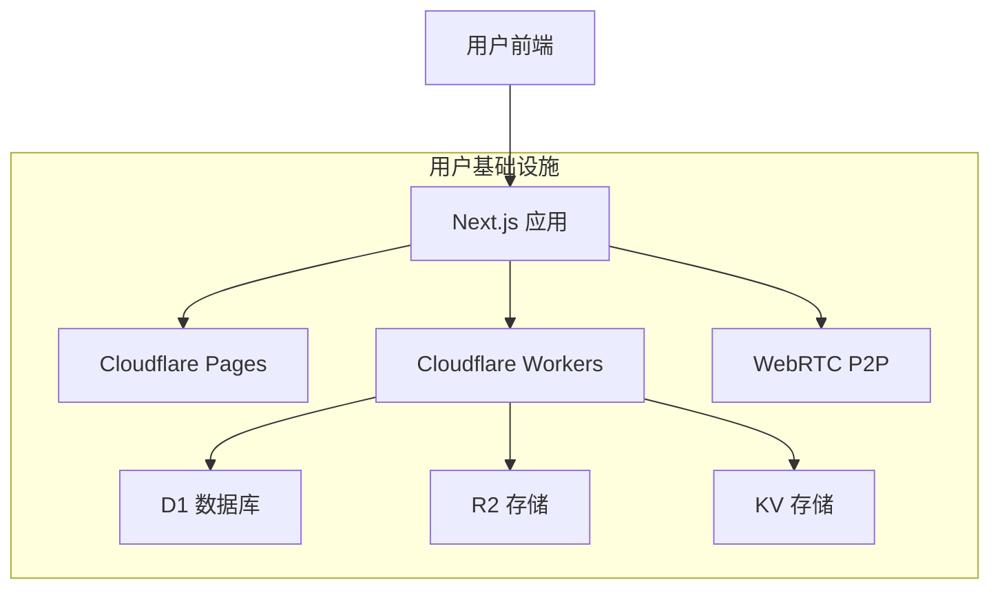

# 构建分布式社交网络应用：基于 Cloudflare D1 和 Next.js 的开发之旅

## 引言

2024年的社交媒体正处于十字路口。Web2平台如X（Twitter）、Facebook和Instagram虽然创造了前所未有的连接性，但却牺牲了隐私、用户自主权和数据所有权。在多年构建传统社交平台的经验中，我亲眼目睹了中心化架构带来的问题：

- **隐私问题**：用户数据集中在企业数据库中
- **内容控制**：武断的内容审核决策
- **高昂成本**：随着平台扩展带来的昂贵基础设施
- **单点故障**：平台级宕机风险
- **创新受限**：封闭生态系统限制开发者

这促使我探索一种完全不同的方法：一个用户完全拥有数据和基础设施的分布式社交网络应用。在本文中，我将分享使用 Cloudflare D1、Next.js 和 WebRTC 构建这个系统的经验。


  本项目旨在证明一个以隐私为先、用户可控的社交网络不仅是可能的，而且在经济上是可行的，每个用户每月仅需 3.44 美元。


## 愿景与架构

### 为什么选择分布式？

传统社交平台采用中心化模式，平台拥有所有用户数据和基础设施。我们的分布式方法则完全相反：

- 每个用户在个人 D1 数据库中拥有自己的数据
- 通过 WebRTC 实现直接的点对点通信
- 没有中央服务器或控制点
- 用户驱动的内容审核
- 完整的数据可移植性和主权

### 核心架构



### 技术栈深度解析

1. **前端 (Next.js + React 18)**
```typescript
// pages/index.tsx
import { useEffect } from 'react'
import { useWebRTC } from '@/hooks/useWebRTC'
import { useFriends } from '@/hooks/useFriends'

export default function Home() {
  const { initializeWebRTC, peers } = useWebRTC()
  const { friends } = useFriends()
  
  useEffect(() => {
    // 与在线好友初始化 WebRTC 连接
    friends.forEach(friend => {
      if (friend.status === 'online') {
        initializeWebRTC(friend.globalId)
      }
    })
  }, [friends])
  
  return (
    <div>
      <FriendsList friends={friends} />
      <P2PChat peers={peers} />
    </div>
  )
}
```

2. **后端 (Hono.js + Workers)**
```typescript
// worker/index.ts
import { Hono } from 'hono'
import { cors } from 'hono/cors'
import { jwt } from 'hono/jwt'

const app = new Hono()

app.use('/*', cors())
app.use('/api/*', jwt({ secret: env.JWT_SECRET }))

// API 路由
app.route('/api/auth', authRouter)
app.route('/api/friends', friendsRouter)
app.route('/api/posts', postsRouter)
app.route('/api/rtc', rtcRouter)

export default app
```

3. **数据库架构 (D1 + Drizzle)**
```typescript
// schema/index.ts
import { sqliteTable, text, integer } from 'drizzle-orm/sqlite-core'

export const users = sqliteTable('users', {
  id: integer('id').primaryKey(),
  globalId: text('global_id').notNull().unique(),
  apiUrl: text('api_url').notNull(),
  publicKey: text('public_key').notNull(),
  createdAt: integer('created_at').notNull(),
})

export const posts = sqliteTable('posts', {
  id: integer('id').primaryKey(),
  userId: integer('user_id').references(() => users.id),
  content: text('content').notNull(),
  mediaUrl: text('media_url'),
  createdAt: integer('created_at').notNull(),
})

export const friends = sqliteTable('friends', {
  id: integer('id').primaryKey(),
  userId: integer('user_id').references(() => users.id),
  friendGlobalId: text('friend_global_id').notNull(),
  friendApiUrl: text('friend_api_url').notNull(),
  status: text('status').notNull(), // pending, accepted, blocked
})
```

## 市场分析：去中心化社交格局

### 协议对比

| 功能 | 我们的方案 | AT Protocol (Bluesky) | ActivityPub | Nostr | Lens Protocol |
|---------|--------------|----------------------|-------------|--------|---------------|
| 架构 | 完全分布式 | 半中心化（中继） | 联邦制 | 完全分布式 | 区块链基础 |
| 数据存储 | 用户自有 D1 | PDS (自托管/托管) | 实例数据库 | 中继 | 区块链 |
| 每用户月成本 | $3.44 | $10-50 (自托管) | $5-20 | 可变 | Gas 费用 |
| 隐私 | 完全控制 | 部分 | 取决于实例 | 高 | 公链 |
| 可扩展性 | 高 | 受中继限制 | 受联邦限制 | 高 | 受链限制 |
| 开发者体验 | 简单 | 复杂 | 中等 | 简单 | 复杂 |

### 深入分析：AT Protocol (Bluesky)

Bluesky 的 AT Protocol 在去中心化方面迈出了重要一步，但仍保留一些中心化组件：

```typescript
// AT Protocol PDS 示例
interface ATProtocolPDS {
  did: string;  // did:plc:xxxxx
  handle: string;
  posts: Post[];
  follows: Follow[];
}

// 我们的分布式方案
interface DistributedNode {
  globalId: string;  // UUID v4
  apiUrl: string;
  publicKey: string;
  localData: D1Database;
}
```

主要区别：
1. 不依赖中央中继服务器
2. 直接点对点通信
3. 更低的运营成本
4. 完整的数据主权

### ActivityPub 集成计划

虽然我们的系统是完全分布式的，但我们认识到联邦制的价值。以下是我们的 ActivityPub 集成策略：

```typescript
// ActivityPub outbox 实现
app.get('/api/activitypub/outbox', async (c) => {
  const db = initDrizzle(c.env)
  const userId = c.get('jwtPayload').userId
  
  const posts = await db.query.posts.findMany({
    where: eq(posts.userId, userId),
    orderBy: desc(posts.createdAt),
  })
  
  return c.json({
    '@context': 'https://www.w3.org/ns/activitystreams',
    type: 'OrderedCollection',
    totalItems: posts.length,
    orderedItems: posts.map(formatActivityPubPost),
  })
})
```

## 市场潜力和目标用户

我们的平台针对几个关键用户群体：

1. **注重隐私的用户**
   - 估计市场：全球 2 亿以上用户
   - 年增长率 15%（Statista，2024）

2. **技术社区**
   - 开发者群体
   - 开源社区
   - 加密货币/Web3 用户

3. **中小型组织**
   - 私人公司网络
   - 教育机构
   - 非营利组织


  预计到 2028 年，去中心化社交市场规模将达到 10 亿美元，复合年增长率为 15%（Statista）。


## 实现深度解析

### P2P 通信层

我们的 WebRTC 实现包含复杂的连接管理：

```typescript
// hooks/useWebRTC.ts
export function useWebRTC() {
  const [peers, setPeers] = useState<Map<string, RTCPeerConnection>>()
  
  const initializePeer = async (targetId: string) => {
    const pc = new RTCPeerConnection({
      iceServers: [
        { urls: 'stun:stun.l.google.com:19302' },
        {
          urls: env.TURN_URL,
          username: env.TURN_USERNAME,
          credential: env.TURN_PASSWORD,
        }
      ]
    })
    
    // 处理连接生命周期
    pc.onicecandidate = ({ candidate }) => {
      if (candidate) {
        sendSignal(targetId, { type: 'candidate', candidate })
      }
    }
    
    pc.onconnectionstatechange = () => {
      if (pc.connectionState === 'failed') {
        // 实现 ICE 重启逻辑
        pc.restartIce()
      }
    }
    
    return pc
  }
  
  // ... 其余实现
}
```

### 内容审核系统

我们的用户驱动审核系统结合了个人和社区控制：

```typescript
// 内容审核架构和 API
export const contentTags = sqliteTable('content_tags', {
  id: integer('id').primaryKey(),
  postId: integer('post_id').references(() => posts.id),
  tag: text('tag').notNull(), // spam, adult, harassment 等
  createdBy: text('created_by').notNull(),
  confidence: real('confidence').notNull(),
  createdAt: integer('created_at').notNull(),
})

app.post('/api/moderation/report', async (c) => {
  const { postId, tag, evidence } = await c.req.json()
  const userId = c.get('jwtPayload').userId
  
  // 添加到个人屏蔽列表
  await db.insert(contentTags).values({
    postId,
    tag,
    createdBy: userId,
    confidence: 1.0,
    createdAt: Date.now(),
  })
  
  // 如果达到阈值则更新社区屏蔽列表
  const tags = await db.query.contentTags.findMany({
    where: eq(contentTags.postId, postId),
  })
  
  if (tags.length >= 5) { // 可配置阈值
    const kv = c.env.KV
    await kv.put(`blocklist:${postId}`, JSON.stringify({
      postId,
      tags: aggregateTags(tags),
      updatedAt: Date.now(),
    }))
  }
  
  return c.json({ success: true })
})
```

## 开发路线图

### 第一阶段：MVP（0-3个月）
- 基础用户认证
- 好友连接
- P2P 消息
- 本地帖子创建/存储

### 第二阶段：增强功能（3-6个月）
- ActivityPub 联邦集成
- 基于 WebRTC mesh 的群聊
- 使用 R2 的媒体共享
- 基础内容审核

### 第三阶段：扩展和集成（6-12个月）
- IPFS 媒体集成
- 基于 DID 的身份
- 增强发现机制
- 移动应用（React Native）


每个阶段都包括全面的测试和社区反馈周期。


## 部署和设置

### 前置要求
- Cloudflare 账号
- Node.js 18+
- pnpm

### 快速开始
```bash
# 克隆和设置
git clone https://github.com/JoeJoeyMa/distributed-social
cd distributed-social
pnpm install

# 配置环境
cp .env.example .env
# 编辑 .env 添加你的 Cloudflare 凭证

# 初始化 D1 数据库
npx wrangler d1 create my-social-db
npx wrangler d1 execute my-social-db --file=./schema.sql

# 部署
npx wrangler deploy
```

### 配置
```typescript
// wrangler.toml
name = "distributed-social"
main = "src/worker/index.ts"

[[ d1_databases ]]
binding = "DB"
database_name = "my-social-db"
database_id = "your-database-id"

[[ r2_buckets ]]
binding = "MEDIA"
bucket_name = "media-storage"

[[ kv_namespaces ]]
binding = "KV"
id = "your-kv-id"
```

## 结论

构建分布式社交平台是一次启发性的旅程。我们已经证明，创建一个以隐私为先、用户可控的社交网络在技术上是可行的，在经济上也是可持续的。


准备加入分布式社交革命了吗？今天就部署你的节点，成为网络的一部分！

[在 GitHub 上开始](https://github.com/JoeJoeyMa/distributed-social)


## 资源和社区

- [文档](https://docs.distributed-social.io)
- [Discord 社区](https://discord.gg/distributed-social)
- [开发博客](https://blog.distributed-social.io)
- [贡献指南](https://github.com/JoeJoeyMa/distributed-social/CONTRIBUTING.md)

如果你有任何问题或想要为项目做出贡献，欢迎联系我们！ 