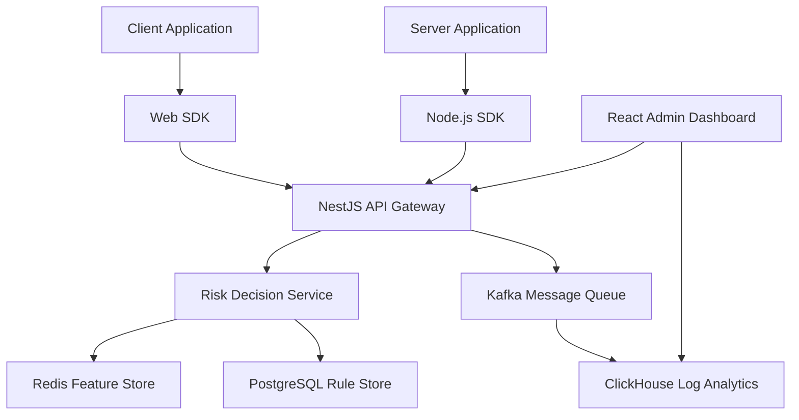

## I. Project Background

Commercial risk control systems are often expensive and lack customization capabilities, making it difficult to respond quickly to evolving business risk mitigation requirements. Development teams need simple, easy-to-use tools (SDKs) for seamless integration of risk control capabilities, while risk control and operations teams require an intuitive, efficient platform for strategy management and optimization. There is a significant gap between these two needs.

## II. Core Design Principles

1. **Dual-Mode Architecture (Inline + Bypass)**: Supports both **"Inline (Synchronous)"** and **"Bypass (Asynchronous)"** modes. This enables millisecond-level real-time risk decisions for critical operations like transactions and logins, while also supporting non-blocking background analysis and risk accumulation calculations for user behavior and content.

2. **Modularity and Extensibility**: The system adopts a microservices or modular architecture. Components (event ingestion, rule engine, data storage, admin dashboard, etc.) have clear responsibilities and low coupling, making them easy to upgrade, extend, and maintain independently.

3. **Data-Driven Decision Making**: Emphasizes the value of data by not only storing risk events but also focusing on risk feature extraction and application. Supports fine-grained strategies based on rich contextual data, laying the foundation for future machine learning model integration.

4. **Ultimate User Experience**: Provides developers with concise, standardized SDKs while offering risk control/operations teams a visual, process-oriented strategy management platform, reducing barriers to entry and improving work efficiency.

## III. System Architecture Overview

The system is logically divided into the following core layers:

```mermaid
graph LR
    subgraph "Business Applications"
        App1[App A: E-commerce]
        App2[App B: Content Platform]
        App3[App C: User Center]
        AppN[...]
    end

    subgraph "Collection Layer"
        SDKs[Multi-language SDKs <br/> (Java, Python, Go...)]
        IngestGW[Event Ingestion Gateway <br/> (API / Message Queue)]
    end

    subgraph "Processing Layer"
        RuleEngine[Rule/Strategy Engine <br/> (Sync/Async Support)]
        FeatureStore[Real-time/Offline Feature Store <br/> (Contextual Data)]
        ActionExecutor[Action Executor]
    end

    subgraph "Management Layer"
        AdminUI[Web Admin Dashboard <br/> (Rule Config / Monitoring / Lists)]
        MgmtAPI[Management API]
    end

    subgraph "Storage & Analytics Layer"
        RuleDB[(Rule Store <br/> PostgreSQL/MySQL)]
        EventDB[(Event Log Store <br/> ClickHouse/ES)]
        ResultDB[(Execution Result Store <br/> MySQL/MongoDB)]
        FeatureDB[(Feature Store <br/> Redis/HBase)]
        Analytics[Analytics Platform <br/> (Kibana/Grafana/BI)]
    end

    App1 -- "Report Events" --> SDKs
    App2 -- "Report Events" --> SDKs
    App3 -- "Report Events" --> SDKs
    AppN -- "Report Events" --> SDKs

    SDKs -- "Send Events (Sync/Async)" --> IngestGW

    IngestGW -- "Distribute Events" --> RuleEngine

    RuleEngine -- "Read Rules" --> RuleDB
    RuleEngine -- "Read Features" --> FeatureStore
    RuleEngine -- "Record Results" --> ResultDB
    RuleEngine -- "Trigger Actions" --> ActionExecutor

    FeatureStore -- "Data Source" --> EventDB
    FeatureStore -- "Data Source" --> FeatureDB

    AdminUI -- "Config/Query" --> MgmtAPI
    MgmtAPI -- "Operations" --> RuleDB
    MgmtAPI -- "Operations" --> FeatureDB
    MgmtAPI -- "Query" --> ResultDB
    MgmtAPI -- "Query" --> EventDB

    IngestGW -- "Raw Event Storage" --> EventDB
    Analytics -- "Data Source" --> EventDB
    Analytics -- "Data Source" --> ResultDB
    AdminUI -- "Reports/Monitoring" --> Analytics

    style SDKs fill:#f9f,stroke:#333,stroke-width:2px
    style RuleEngine fill:#ccf,stroke:#333,stroke-width:2px
    style AdminUI fill:#9cf,stroke:#333,stroke-width:2px
```

* **Collection Layer**: Responsible for securely and efficiently collecting risk event data from various business units.
* **Processing Layer**: The risk control brain, responsible for real-time/near-real-time analysis, rule matching, risk decisions, and action execution.
* **Management Layer**: Provides a human-machine interface for operations and risk control personnel to manage the entire strategy lifecycle.
* **Storage & Analytics Layer**: Responsible for massive data persistence, querying, and deep analysis.

## IV. Core Module Details: Features, Principles, and Effectiveness

### 4.1 Data Collection SDK & Gateway

* **Functional Positioning**: Provides standard, easy-to-use client libraries for rapid business integration and stable, highly available server-side entry points for receiving event data.
* **Key Features**:
    * **Multi-language Support**: Offers SDKs for mainstream languages including Java, Python, Go.
    * **Standardized Event Model**: Defines unified event schema with support for custom extension fields.
    * **Sync/Async Reporting**: SDK supports blocking (synchronous) or non-blocking (asynchronous) reporting based on scenarios.
    * **Lightweight Integration**: SDK design minimizes performance impact on business applications.
    * **High Availability**: Gateway uses cluster deployment with load balancing and fast failure handling.
* **Implementation Principles**:
    * SDK encapsulates data validation, serialization, network communication (HTTP/gRPC for Sync, Kafka/Pulsar Producer for Async) logic.
    * Gateway uses high-performance web frameworks (e.g., Go Gin/Echo, Java Spring WebFlux) or acts directly as message queue consumer clusters, performing basic format validation and rate limiting on inbound data.
* **Pain Points Addressed**: Reduces complexity of risk control integration while ensuring data collection stability and standardization.
* **Expected Results/Metrics**:
    * **Developer Integration Time**: Average < 0.5 workday for new business integration.
    * **SDK Performance Overhead**: P99 latency impact < 5ms on business applications.
    * **Gateway Throughput**: Supports > 50,000 QPS (based on business scale).
    * **Data Ingestion Success Rate**: > 99.99%.

```typescript:src%2Fsdk%2Fweb%2Findex.ts
interface RiskEvent {
  eventType: string;
  userId?: string;
  deviceInfo: DeviceInfo;
  timestamp: number;
  extraData?: Record<string, any>;
}

class RiskSDK {
  private readonly endpoint: string;
  private readonly apiKey: string;
  private queue: RiskEvent[] = [];

  constructor(config: SDKConfig) {
    this.endpoint = config.endpoint;
    this.apiKey = config.apiKey;
    this.initializeEventListeners();
  }

  // Synchronous risk check
  async checkRisk(event: RiskEvent): Promise<RiskResponse> {
    try {
      const response = await fetch(`${this.endpoint}/check`, {
        method: 'POST',
        headers: {
          'Content-Type': 'application/json',
          'X-API-Key': this.apiKey
        },
        body: JSON.stringify(event)
      });
      return await response.json();
    } catch (error) {
      console.error('Risk check failed:', error);
      return { status: 'error', code: 500 };
    }
  }

  // Asynchronous event reporting
  async report(event: RiskEvent): Promise<void> {
    this.queue.push(event);
    if (this.queue.length >= 10) {
      await this.flush();
    }
  }

  private async flush(): Promise<void> {
    if (this.queue.length === 0) return;
    
    const events = [...this.queue];
    this.queue = [];

    try {
      await fetch(`${this.endpoint}/batch`, {
        method: 'POST',
        headers: {
          'Content-Type': 'application/json',
          'X-API-Key': this.apiKey
        },
        body: JSON.stringify({ events })
      });
    } catch (error) {
      console.error('Batch report failed:', error);
    }
  }
}
```

### 4.2 Rule/Strategy Engine

* **Functional Positioning**: Core decision-making unit that evaluates input events against preset rules and contextual data for risk assessment.
* **Key Features**:
    * **High-Performance Matching**: Millisecond-level rule matching and decision making (for synchronous mode).
    * **Complex Rule Support**: Supports condition combinations, list matching, regular expressions, external function calls, and even embedded scripts (Groovy/Lua/AviatorScript).
    * **Real-time Feature Integration**: Can query and utilize contextual features from Feature Store in real-time (e.g., user profile tags, IP risk scores, device behavior history counts).
    * **Dynamic Rule Loading**: Hot-load, update, or disable rules without service restart.
    * **Rule Priority and Exclusivity**: Supports rule execution priority setting and mutual exclusion groups.
* **Implementation Principles**:
    * May use mature rule engine libraries (like Drools) or custom DSL/script engine.
    * Pre-compile or index optimize rules to accelerate matching process.
    * Use Redis or similar in-memory databases to cache hot rules and contextual feature data.
    * Implement dynamic rule updates through configuration center subscription (e.g., Nacos, Apollo) or database change notifications.
* **Pain Points Addressed**: Improves risk identification accuracy and real-time response while supporting flexible strategy configuration.
* **Expected Results/Metrics**:
    * **Sync Decision P99 Latency**: < 10ms (excluding external IO).
    * **Async Processing Throughput**: > 10,000 events/sec per node.
    * **Rule Dynamic Effect Time**: < 1 minute.
    * **Engine Availability**: > 99.99%.

```javascript
@Injectable()
export class RiskService {
  constructor(
    @InjectRepository(RiskRule)
    private ruleRepo: Repository<RiskRule>,
    private readonly redisService: RedisService,
    private readonly kafkaService: KafkaService,
  ) {}

  async checkRisk(event: RiskEvent): Promise<RiskDecision> {
    // 1. Load rules
    const rules = await this.loadActiveRules();
    
    // 2. Get feature data
    const features = await this.loadFeatures(event.userId);
    
    // 3. Rule matching
    const decisions = await Promise.all(
      rules.map(rule => this.evaluateRule(rule, event, features))
    );

    // 4. Aggregate decision results
    return this.aggregateDecisions(decisions);
  }

  private async evaluateRule(
    rule: RiskRule, 
    event: RiskEvent,
    features: Features
  ): Promise<RuleResult> {
    const context = {
      event,
      features,
      functions: this.getRuleFunctions()
    };

    try {
      const result = await this.ruleEngine.evaluate(rule.expression, context);
      return {
        ruleId: rule.id,
        matched: result,
        score: rule.score
      };
    } catch (error) {
      console.error(`Rule evaluation failed: ${rule.id}`, error);
      return {
        ruleId: rule.id,
        matched: false,
        error: error.message
      };
    }
  }
}
```

### 4.3 Rule Management Dashboard (Web UI & API)

* **Functional Positioning**: One-stop platform for non-technical risk control/operations personnel to manage strategies, monitor risks, and handle events.
* **Key Features**:
    * **Visual Rule Editor**: Provides drag-and-drop or form-based rule builder, also supports expert mode for direct DSL/script writing.
    * **Rule Lifecycle Management**: Supports rule version control, grayscale release, A/B testing, one-click rollback.
    * **Real-time Effect Monitoring**: Provides dashboards showing rule hit rates, coverage, event processing trends, risk distribution, etc.
    * **List Management**: Easy management of various blacklists/whitelists (IP, device, user ID, phone number, etc.).
    * **Permission Management**: Supports role-based fine-grained access control.
* **Implementation Principles**:
    * Frontend uses React with visualization libraries like ECharts/AntV G2 adapted for AI Prompt templates.
    * Backend provides RESTful APIs for business logic processing, database interaction, and rule engine updates.
* **Pain Points Addressed**: Significantly improves strategy configuration and optimization efficiency, lowers strategy management barriers, enabling operations to respond quickly to risks.
* **Expected Results/Metrics**:
    * **New Rule (Simple) Configuration Time**: < 10 minutes.
    * **Operations Staff Satisfaction**: > 4.5 / 5.0.
    * **Strategy Adjustment Frequency**: Supports multiple adjustments per day.

```react
import { useState, useEffect } from 'react';
import { Form, Card, Button, message } from 'antd';
import { useQuery, useMutation } from 'react-query';
import { RuleBuilder } from '@/components/RuleBuilder';
import { ruleService } from '@/services';

const RuleEditor: React.FC = () => {
  const [form] = Form.useForm();

  const { data: ruleTemplates } = useQuery(
    'ruleTemplates',
    ruleService.getTemplates
  );

  const createRule = useMutation(ruleService.createRule, {
    onSuccess: () => {
      message.success('Rule created successfully');
    },
  });

  const handleSubmit = async (values: any) => {
    try {
      await createRule.mutateAsync({
        ...values,
        status: 'draft'
      });
    } catch (error) {
      message.error('Failed to create rule');
    }
  };

  return (
    <Card title="Create Risk Control Rule">
      <Form
        form={form}
        onFinish={handleSubmit}
        layout="vertical"
      >
        <RuleBuilder 
          templates={ruleTemplates}
          onChange={value => form.setFieldsValue({ rule: value })}
        />
        <Form.Item>
          <Button type="primary" htmlType="submit">
            Save Rule
          </Button>
        </Form.Item>
      </Form>
    </Card>
  );
};

export default RuleEditor;
```

### 4.4 Data Storage and Analytics Layer

* **Functional Positioning**: Persistently stores various data generated by system operation and provides efficient query and analysis capabilities.
* **Key Features**:
    * **Classified Storage**: Selects optimal storage solutions based on different data characteristics.
    * **Massive Log Storage**: Supports PB-level event log storage and near-real-time querying.
    * **Efficient Feature Access**: Supports high-concurrency, low-latency feature data read/write.
    * **Analytics-Friendly**: Provides interfaces or capabilities for connecting with BI and data analysis tools.
* **Implementation Principles/Technology Selection**:
    * **Rule/Execution Result Store**: Uses PostgreSQL or MySQL, leveraging their transactional and relational query capabilities.
    * **Event Log Store**: Uses ClickHouse or Elasticsearch, leveraging their excellent write performance and aggregation query capabilities.
    * **Feature/List Store**: Core features and lists cached in Redis; persistent and complex feature storage can use HBase, Cassandra, or relational databases.
    * **Analytics Platform**: Can be quickly built on ClickHouse/ES + Grafana/Kibana, or integrate with existing company data warehouse/BI platforms.
* **Pain Points Addressed**: Solves massive risk data storage, query, and analysis challenges, providing data foundation for strategy optimization and model iteration.
* **Expected Results/Metrics**:
    * **Event Log Query P95 Latency**: < 1 second (common aggregation queries).
    * **Feature Store Read P99 Latency**: < 5ms (cache hit).
    * **Data Storage Cost**: Controlled within reasonable range, with good horizontal scalability.
    * **Data Analyzability**: Supports self-service ad-hoc queries by operations/analysts.



## V. Rule Strategy System Construction

* **Multi-dimensional Rule Expression**: Supports from simple list matching and threshold judgment to complex rules based on multi-event correlation analysis, user behavior sequences, geographical location, and other multi-dimensional combinations.
* **Feature Engineering**: Built-in or easily extensible feature calculation capabilities (e.g., user login failure count in N days, deviation of current transaction amount from historical average), transforming raw events into more meaningful risk features.
* **Strategy Lifecycle**: Provides complete strategy creation, simulation, testing (shadow mode), grayscale, deployment, monitoring, and retirement process management.
* **Model Integration**: Reserved interfaces for future easy integration of internal or third-party machine learning models (such as fraud scoring, anomaly detection models), enabling hybrid decision-making between rules and models.
* **Risk Loss Reduction**: Effectively reduces direct economic losses from fraud and abuse through more accurate, real-time risk identification and handling.
* **Development Experience Optimization**: Standardized SDKs significantly reduce business integration costs, letting developers focus on business logic.
* **Data-Driven Growth**: Risk data accumulated not only serves risk control but also feeds back to business, used for user profiling, reputation assessment, etc., empowering business growth.

```typescript
// 1. Batch reporting optimization
const batchReporter = new BatchReporter({
  maxBatchSize: 50,
  maxWaitTime: 2000,
  retryStrategy: exponentialBackoff({
    maxRetries: 3,
    initialDelay: 1000
  })
});

// 2. Feature data local caching
const featureCache = new LRUCache({
  max: 1000,
  maxAge: 1000 * 60 * 5 // 5 minutes
});

// 3. WebWorker for complex computation
const riskWorker = new Worker('risk-worker.js');
riskWorker.postMessage({
  type: 'COMPUTE_DEVICE_FINGERPRINT',
  payload: deviceInfo
});
```

## VI. Future Roadmap

* **Intelligence Enhancement**: Deep integration of machine learning capabilities for automated risk scoring, anomaly detection, and strategy recommendations.
* **Strategy A/B Testing Platform**: More scientific evaluation of different strategy effects.
* **Visual Correlation Analysis**: Help analysts discover risk patterns and groups more intuitively.
* **Cross-System Integration**: Strengthen integration with other internal systems (like CRM, credit review) to build a more comprehensive risk view.

