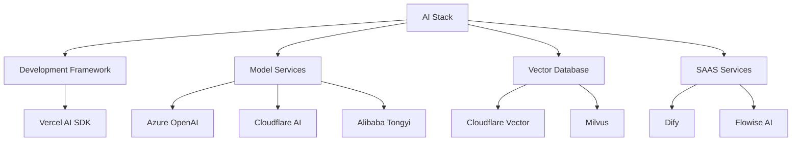
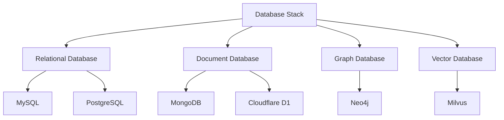
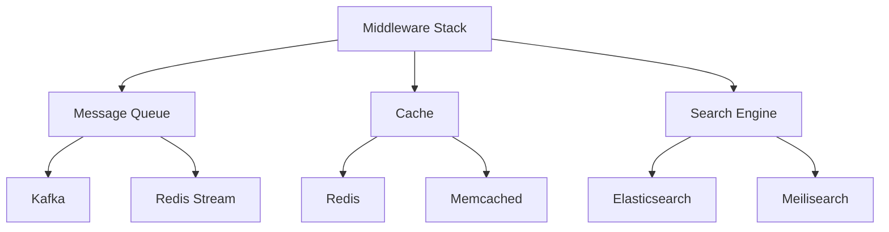
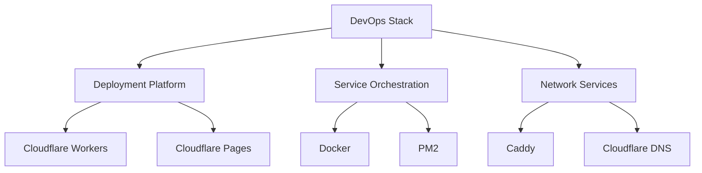

# Full Stack Technology Stack Selection and Best Practices 2024

## Introduction


## Technology Stack Selection Principles

When choosing a technology stack, we need to consider the following dimensions:

### 1. Cost-Effectiveness and Efficiency
- Cost-effectiveness and efficiency are the primary principles; any selection that deviates from these principles is irresponsible
- Evaluate the learning curve and maintenance costs of the technology stack
- Consider the ecosystem and community support

### 2. Technology Maturity
- Choose mature technologies with active communities and comprehensive documentation
- Avoid cutting-edge but unstable technologies
- Ensure long-term maintenance and update plans for the technology stack

### 3. Team Compatibility
- Prioritize technology stacks familiar to the team
- Assess the alignment between technology stack and team skills
- Consider the team's learning capacity and willingness to adopt new technologies

### 4. Avoid Over-Engineering
Here are some common over-engineering cases:
- Multiple refactoring before product launch
- Excessive focus on performance optimization before implementing features
- Pursuing extreme scalability with a small user base

## Technology Stack Overview

### Frontend Technology Stack

```mermaid
graph TD
    A[Frontend Stack] --> B[Framework]
    A --> C[Build Tools]
    A --> D[UI Components]
    A --> E[State Management]
    
    B --> B1[React 18+]
    B --> B2[Next.js 14]
    
    C --> C1[Turbo]
    C --> C2[PNPM]
    C --> C3[TSUP]
    
    D --> D1[@radix-ui]
    D --> D2[Tailwind CSS]
    D --> D3[shadcn/ui]
    
    E --> E1[use-immer]
    E --> E2[Zustand]
```

### Backend Technology Stack

```mermaid
graph TD
    A[Backend Stack] --> B[Service Framework]
    A --> C[Data Storage]
    A --> D[API Design]
    A --> E[Function Modules]
    
    B --> B1[Hono.js]
    B --> B2[Next.js API]
    
    C --> C1[Prisma ORM]
    C --> C2[Cloudflare D1]
    
    D --> D1[@hono/zod-openapi]
    D --> D2[Swagger UI]
    
    E --> E1[Email Service]
    E --> E2[Analytics]
    E --> E3[Authentication]
```

### AI Technology Stack



### Database Technology Stack



### Middleware Technology Stack



### DevOps Technology Stack


## Essential Utility Packages

Here are some indispensable utility packages for development:

- **zodjs**: Powerful data validation and TypeScript type inference tool
  ```typescript
  import { z } from 'zod';
  
  // Define data model
  const UserSchema = z.object({
    id: z.string().uuid(),
    name: z.string().min(2).max(50),
    email: z.string().email(),
    age: z.number().min(0).max(120).optional(),
  });
  
  // Type inference
  type User = z.infer<typeof UserSchema>;
  
  // Data validation
  function createUser(data: unknown): User {
    return UserSchema.parse(data);
  }
  ```

- **tsx**: Tool for directly running TypeScript files
  ```bash
  # Run ts file directly
  npx tsx src/script.ts
  
  # Run in development mode (with hot reload)
  npx tsx watch src/server.ts
  ```

- **vitest**: Modern unit testing framework
  ```typescript
  import { describe, it, expect } from 'vitest';
  import { sum } from './math';
  
  describe('math utils', () => {
    it('should add two numbers correctly', () => {
      expect(sum(1, 2)).toBe(3);
    });
  });
  ```

- **nanoid**: Lightweight ID generation tool
  ```typescript
  import { nanoid } from 'nanoid';
  
  // Generate unique ID
  const id = nanoid(); // "V1StGXR8_Z5jdHi6B-myT"
  
  // Specify length
  const shortId = nanoid(10); // "IRFa-VaY2b"
  ```

## SAAS Services Deep Dive

### 1. Dify - Open Source LLMOps Platform

Dify is a powerful LLMOps platform that provides a complete toolchain for large language model application development and operations:

#### Core Features
- **Prompt Management**: Professional prompt orchestration and version management
- **Multi-Model Support**: Supports OpenAI, Azure OpenAI, Alibaba Tongyi, and other model services
- **Application Orchestration**: Visual conversation flow design
- **Data Security**: Built-in data encryption and access control

#### Best Practices
```typescript
// Using Dify API to build conversation applications
const DIFY_API_KEY = process.env.DIFY_API_KEY;
const DIFY_APP_ID = process.env.DIFY_APP_ID;

async function chatWithDify(message: string) {
  const response = await fetch(`https://api.dify.ai/v1/chat-messages`, {
    method: 'POST',
    headers: {
      'Authorization': `Bearer ${DIFY_API_KEY}`,
      'Content-Type': 'application/json',
    },
    body: JSON.stringify({
      app_id: DIFY_APP_ID,
      messages: [{ role: 'user', content: message }],
    }),
  });
  return response.json();
}
```

### 2. Umami - Open Source Web Analytics Tool

Umami is a privacy-focused web analytics tool that provides rich data analysis features:

#### Core Features
- **Cookie-less Tracking**: Compliant with GDPR and other privacy regulations
- **Real-time Analysis**: Real-time visitor data updates
- **Custom Events**: Support for tracking custom behaviors
- **Multi-site Management**: Single panel for managing multiple websites

#### Deployment Configuration
```yaml
# docker-compose.yml
version: '3'
services:
  umami:
    image: ghcr.io/umami-software/umami:postgresql-latest
    ports:
      - "3000:3000"
    environment:
      DATABASE_URL: postgresql://umami:umami@db:5432/umami
      DATABASE_TYPE: postgresql
      APP_SECRET: your-secret-key

  db:
    image: postgres:12-alpine
    environment:
      POSTGRES_DB: umami
      POSTGRES_USER: umami
      POSTGRES_PASSWORD: umami
    volumes:
      - ./sql/schema.postgresql.sql:/docker-entrypoint-initdb.d/schema.postgresql.sql:ro
      - ./data:/var/lib/postgresql/data
```

### 3. Flowise - Visual AI Workflow Platform

Flowise is a powerful AI workflow design and deployment platform:

#### Key Advantages
- **Visual Orchestration**: Drag-and-drop workflow design
- **Rich Components**: Built-in AI and data processing components
- **API Integration**: Automatic REST API generation
- **Version Control**: Workflow version management

#### Deployment Example
```yaml
# docker-compose.yml
version: '3.8'

services:
  flowise:
    image: flowiseai/flowise
    ports:
      - "3000:3000"
    environment:
      - DATABASE_PATH=/root/.flowise
      - APIKEY_PATH=/root/.flowise
      - SECRETKEY_PATH=/root/.flowise
    volumes:
      - ~/.flowise:/root/.flowise
```

## Database Technology Stack Deep Dive

### 1. MySQL - Enterprise-Grade Relational Database

#### Performance Optimization Strategies
- **Index Optimization**: Proper use of composite indexes, avoid over-indexing
- **Query Optimization**: Use EXPLAIN to analyze execution plans
- **Partitioning Strategy**: Choose partitioning scheme based on business characteristics
- **Master-Slave Architecture**: Implement read-write separation for performance improvement

#### Best Practices
```sql
-- Index optimization example
CREATE TABLE users (
  id BIGINT PRIMARY KEY AUTO_INCREMENT,
  username VARCHAR(50) NOT NULL,
  email VARCHAR(100) NOT NULL,
  status TINYINT NOT NULL DEFAULT 1,
  created_at TIMESTAMP NOT NULL DEFAULT CURRENT_TIMESTAMP,
  -- Composite index
  INDEX idx_status_created (status, created_at),
  -- Unique index
  UNIQUE INDEX idx_email (email)
);

-- Partitioned table example
CREATE TABLE orders (
  id BIGINT NOT NULL,
  user_id BIGINT NOT NULL,
  amount DECIMAL(10,2) NOT NULL,
  created_at TIMESTAMP NOT NULL
)
PARTITION BY RANGE (UNIX_TIMESTAMP(created_at)) (
  PARTITION p_2023 VALUES LESS THAN (UNIX_TIMESTAMP('2024-01-01 00:00:00')),
  PARTITION p_2024 VALUES LESS THAN (UNIX_TIMESTAMP('2025-01-01 00:00:00'))
);
```

### 2. MongoDB - Distributed Document Database

#### Architecture Design Points
- **Schema Design**: Optimize document structure based on query patterns
- **Indexing Strategy**: Create composite indexes to support complex queries
- **Sharding Cluster**: Horizontal scaling for high availability

#### Practice Examples
```javascript
// Schema design example
const OrderSchema = new Schema({
  userId: { type: ObjectId, ref: 'User', index: true },
  items: [{
    productId: { type: ObjectId, ref: 'Product' },
    quantity: Number,
    price: Number
  }],
  status: { type: String, enum: ['pending', 'paid', 'shipped'], index: true },
  totalAmount: Number,
  // Composite index field
  createdAt: { type: Date, default: Date.now }
});

// Create composite index
OrderSchema.index({ userId: 1, status: 1, createdAt: -1 });

// Sharding configuration
db.adminCommand({
  shardCollection: "mydb.orders",
  key: { userId: "hashed" }
});
```

### 3. Neo4j - Graph Database

#### Application Scenarios
- **Social Networks**: Relationship graph analysis
- **Recommendation Systems**: Relationship-based personalized recommendations
- **Knowledge Graphs**: Complex knowledge system construction

#### Query Examples
```cypher
// Create user nodes and relationships
CREATE (u1:User {id: 1, name: 'Alice'})
CREATE (u2:User {id: 2, name: 'Bob'})
CREATE (u1)-[:FOLLOWS]->(u2)

// Find second-degree relationships
MATCH (user:User {name: 'Alice'})-[:FOLLOWS*2]->(follower)
RETURN follower.name;

// Shortest path query
MATCH p=shortestPath(
  (user1:User {name: 'Alice'})-[:FOLLOWS*]-(user2:User {name: 'Charlie'})
)
RETURN p;
```

## Middleware Technology Stack Deep Dive

### 1. Kafka - Distributed Message Queue

#### Architectural Features
- **High Throughput**: Parallel processing with partitions
- **Reliability**: Multi-replica mechanism
- **Scalability**: Support for horizontal scaling
- **Persistence**: Message persistence storage

#### Best Practices
```typescript
// Kafka producer example
import { Kafka } from 'kafkajs';

const kafka = new Kafka({
  clientId: 'my-app',
  brokers: ['localhost:9092']
});

const producer = kafka.producer();

async function sendMessage() {
  await producer.connect();
  await producer.send({
    topic: 'test-topic',
    messages: [
      { key: 'key1', value: JSON.stringify({ hello: 'world' }) }
    ],
  });
}

// Kafka consumer example
const consumer = kafka.consumer({ groupId: 'test-group' });

async function startConsumer() {
  await consumer.connect();
  await consumer.subscribe({ topic: 'test-topic', fromBeginning: true });

  await consumer.run({
    eachMessage: async ({ topic, partition, message }) => {
      console.log({
        value: message.value.toString(),
      });
    },
  });
}
```

### 2. Redis - High-Performance Cache

#### Use Cases
- **Cache Layer**: Reduce database pressure
- **Session Storage**: Distributed session management
- **Message Queue**: Lightweight message queue
- **Leaderboard**: Real-time ranking statistics

#### Practice Examples
```typescript
import { Redis } from 'ioredis';

const redis = new Redis({
  host: 'localhost',
  port: 6379,
  // Cluster configuration
  cluster: true,
  nodes: [
    { host: 'node1', port: 6379 },
    { host: 'node2', port: 6379 },
    { host: 'node3', port: 6379 }
  ]
});

// Caching example
async function cacheUser(userId: string, userData: any) {
  await redis.set(`user:${userId}`, JSON.stringify(userData), 'EX', 3600);
}

// Distributed lock
async function acquireLock(lockKey: string, timeout: number) {
  const token = Math.random().toString(36);
  const acquired = await redis.set(lockKey, token, 'NX', 'EX', timeout);
  return acquired ? token : null;
}

// Leaderboard implementation
async function updateLeaderboard(userId: string, score: number) {
  await redis.zadd('leaderboard', score, userId);
  // Get top 10
  const top10 = await redis.zrevrange('leaderboard', 0, 9, 'WITHSCORES');
  return top10;
}
```

## Frontend Technology Stack Deep Dive

### 1. Project Build - Turbo + PNPM + Next.js

Using Turbo and PNPM to set up monorepo project structure:

```bash
# Initialize project
pnpm dlx create-turbo@latest my-turborepo
cd my-turborepo

# Install dependencies
pnpm install

# Create new app or package
pnpm turbo gen workspace
```

Project structure example:

```
.
├── apps/
│   ├── web/           # Next.js main application
│   └── docs/          # Documentation site
├── packages/
│   ├── ui/           # Shared UI components
│   ├── config/       # Shared configuration
│   └── utils/        # Utility functions
├── turbo.json        # Turbo configuration
└── package.json      # Workspace configuration
```

turbo.json configuration example:

```json
{
  "$schema": "https://turbo.build/schema.json",
  "globalDependencies": ["**/.env.*local"],
  "pipeline": {
    "build": {
      "dependsOn": ["^build"],
      "outputs": [".next/**", "!.next/cache/**"]
    },
    "lint": {},
    "dev": {
      "cache": false,
      "persistent": true
    }
  }
}
```

### 2. UI Component Library Best Practices

In modern frontend development, we recommend using the combination of @radix-ui + Tailwind CSS + shadcn/ui:

#### @radix-ui Basic Components

```tsx
import * as Dialog from '@radix-ui/react-dialog';

function ConfirmDialog() {
  return (
    <Dialog.Root>
      <Dialog.Trigger>
        <button>Open Dialog</button>
      </Dialog.Trigger>
      <Dialog.Portal>
        <Dialog.Overlay className="fixed inset-0 bg-black/50" />
        <Dialog.Content className="fixed top-1/2 left-1/2 -translate-x-1/2 -translate-y-1/2 bg-white p-6 rounded-lg">
          <Dialog.Title>Confirm Action</Dialog.Title>
          <Dialog.Description>
            Are you sure you want to perform this action?
          </Dialog.Description>
          <div className="mt-4 flex justify-end gap-2">
            <Dialog.Close>
              <button>Cancel</button>
            </Dialog.Close>
            <button onClick={() => console.log('Confirmed')}>Confirm</button>
          </div>
        </Dialog.Content>
      </Dialog.Portal>
    </Dialog.Root>
  );
}
```

#### shadcn/ui Advanced Components

```tsx
import {
  Card,
  CardContent,
  CardDescription,
  CardFooter,
  CardHeader,
  CardTitle,
} from "@/components/ui/card";

function ProductCard() {
  return (
    <Card>
      <CardHeader>
        <CardTitle>Product Name</CardTitle>
        <CardDescription>Product Description</CardDescription>
      </CardHeader>
      <CardContent>
        <p>Product details...</p>
      </CardContent>
      <CardFooter>
        <button>Buy Now</button>
      </CardFooter>
    </Card>
  );
}
```

### 3. State Management Best Practices

In Next.js applications, we recommend using lightweight use-immer for state management:

#### Simple Component State

```tsx
import { useImmer } from 'use-immer';

function TodoList() {
  const [todos, updateTodos] = useImmer([
    { id: 1, text: 'Learn React', done: false },
    { id: 2, text: 'Learn Next.js', done: false },
  ]);

  const toggleTodo = (id: number) => {
    updateTodos(draft => {
      const todo = draft.find(t => t.id === id);
      if (todo) todo.done = !todo.done;
    });
  };

  return (
    <ul>
      {todos.map(todo => (
        <li key={todo.id} onClick={() => toggleTodo(todo.id)}>
          {todo.text} {todo.done ? '✓' : ''}
        </li>
      ))}
    </ul>
  );
}
```

#### Complex Application State

```tsx
import { createStore } from 'zustand';
import { immer } from 'zustand/middleware/immer';

interface Post {
  id: number;
  title: string;
  content: string;
}

interface PostStore {
  posts: Post[];
  loading: boolean;
  addPost: (post: Post) => void;
  fetchPosts: () => Promise<void>;
}

const usePostStore = createStore(
  immer<PostStore>((set) => ({
    posts: [],
    loading: false,
    addPost: (post) =>
      set((state) => {
        state.posts.push(post);
      }),
    fetchPosts: async () => {
      set((state) => { state.loading = true });
      try {
        const response = await fetch('/api/posts');
        const posts = await response.json();
        set((state) => {
          state.posts = posts;
          state.loading = false;
        });
      } catch (error) {
        set((state) => { state.loading = false });
        console.error('Failed to fetch posts:', error);
      }
    },
  }))
);
```
## Backend Technology Stack Deep Dive

### 1. API Interface Design - OpenAPI Specification

Using Hono.js + Zod to build type-safe API interfaces:

```typescript
import { OpenAPIHono } from '@hono/zod-openapi';
import { z } from 'zod';

const app = new OpenAPIHono();

// Define request and response Schema
const UserSchema = z.object({
  id: z.string().uuid(),
  name: z.string().min(2),
  email: z.string().email(),
});

const CreateUserSchema = UserSchema.omit({ id: true });

// Define API routes
app.openapi(
  '/users',
  {
    method: 'post',
    request: {
      body: {
        content: {
          'application/json': {
            schema: CreateUserSchema,
          },
        },
      },
    },
    responses: {
      200: {
        content: {
          'application/json': {
            schema: UserSchema,
          },
        },
      },
    },
  },
  async (c) => {
    const data = c.req.valid('json');
    const user = await createUser(data);
    return c.json(user);
  }
);

// Generate OpenAPI documentation
app.doc('/docs', {
  openapi: '3.0.0',
  info: {
    title: 'User API',
    version: '1.0.0',
  },
});
```

### 2. Database Operations - Prisma ORM

Best practices for database operations using Prisma:

```typescript
// schema.prisma
datasource db {
  provider = "postgresql"
  url      = env("DATABASE_URL")
}

model User {
  id        String    @id @default(uuid())
  email     String    @unique
  name      String
  posts     Post[]
  createdAt DateTime  @default(now())
  updatedAt DateTime  @updatedAt
}

model Post {
  id        String    @id @default(uuid())
  title     String
  content   String
  published Boolean   @default(false)
  author    User      @relation(fields: [authorId], references: [id])
  authorId  String
  createdAt DateTime  @default(now())
  updatedAt DateTime  @updatedAt
}
```

Database operation examples:

```typescript
import { PrismaClient } from '@prisma/client';

const prisma = new PrismaClient();

// Create user and posts
async function createUserWithPosts() {
  const user = await prisma.user.create({
    data: {
      email: 'alice@example.com',
      name: 'Alice',
      posts: {
        create: [
          {
            title: 'Hello World',
            content: 'This is my first post!',
            published: true,
          },
        ],
      },
    },
    include: {
      posts: true,
    },
  });
  return user;
}

// Query paginated post list
async function getPublishedPosts(page: number, pageSize: number) {
  const posts = await prisma.post.findMany({
    where: {
      published: true,
    },
    include: {
      author: {
        select: {
          name: true,
          email: true,
        },
      },
    },
    skip: (page - 1) * pageSize,
    take: pageSize,
    orderBy: {
      createdAt: 'desc',
    },
  });
  return posts;
}
```

### 3. Email Service Integration

Building modern email services using React Email + Nodemailer:

```typescript
// email-templates/WelcomeEmail.tsx
import { Html, Head, Body, Container, Text, Button } from '@react-email/components';

export function WelcomeEmail({ username }: { username: string }) {
  return (
    <Html>
      <Head />
      <Body style={{
        backgroundColor: '#ffffff',
        margin: '0 auto',
        fontFamily: 'system-ui'
      }}>
        <Container>
          <Text>Welcome {username} to our community!</Text>
          <Button
            href="https://example.com/get-started"
            style={{
              backgroundColor: '#000000',
              color: '#ffffff',
              padding: '12px 20px',
            }}
          >
            Get Started
          </Button>
        </Container>
      </Body>
    </Html>
  );
}

// email-service.ts
import nodemailer from 'nodemailer';
import { render } from '@react-email/render';
import { WelcomeEmail } from './email-templates/WelcomeEmail';

const transporter = nodemailer.createTransport({
  host: process.env.SMTP_HOST,
  port: Number(process.env.SMTP_PORT),
  secure: true,
  auth: {
    user: process.env.SMTP_USER,
    pass: process.env.SMTP_PASS,
  },
});

export async function sendWelcomeEmail(to: string, username: string) {
  const html = render(WelcomeEmail({ username }));
  
  await transporter.sendMail({
    from: '"Team" <team@example.com>',
    to,
    subject: 'Welcome to Our Community',
    html,
  });
}
```

## AI Technology Stack Deep Dive

### 1. Vercel AI SDK Integration

Implementing AI features using Vercel AI SDK:

```typescript
// app/api/chat/route.ts
import { Configuration, OpenAIApi } from 'openai-edge';
import { OpenAIStream, StreamingTextResponse } from 'ai';

const config = new Configuration({
  apiKey: process.env.OPENAI_API_KEY,
});

const openai = new OpenAIApi(config);

export async function POST(req: Request) {
  const { messages } = await req.json();

  const response = await openai.createChatCompletion({
    model: 'gpt-3.5-turbo',
    stream: true,
    messages: messages.map((message: any) => ({
      content: message.content,
      role: message.role,
    })),
  });

  const stream = OpenAIStream(response);
  return new StreamingTextResponse(stream);
}
```