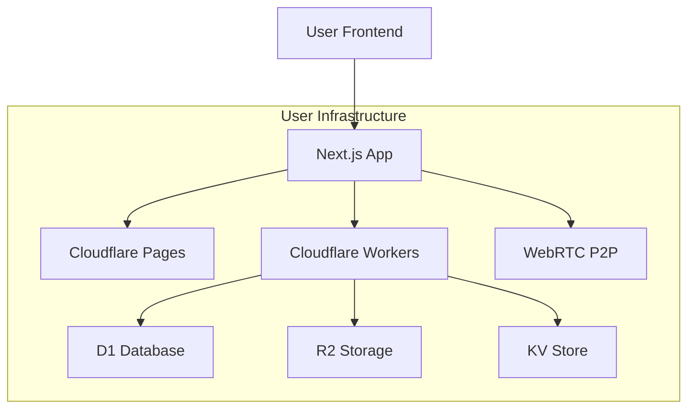

# Building a Distributed Social WebApp: A Journey with Cloudflare D1 and Next.js

## Introduction

The social media landscape in 2024 is at a crossroads. Web2 platforms like X, Facebook, and Instagram have created unprecedented connectivity but at the cost of privacy, user autonomy, and data ownership. After years of building traditional social platforms, I've witnessed firsthand how centralized architectures lead to:

- **Privacy Concerns**: User data concentrated in corporate databases
- **Content Control**: Arbitrary moderation decisions
- **High Costs**: Expensive infrastructure as platforms scale
- **Single Points of Failure**: Platform-wide outages
- **Limited Innovation**: Closed ecosystems restricting developers

This motivated me to explore a radically different approach: a fully distributed social WebApp where users own their data and infrastructure. In this article, I'll share my experience building this system using Cloudflare D1, Next.js, and WebRTC.


  This project aims to prove that a privacy-first, user-controlled social network is not just possible, but economically viable at $3.44/month per user.


## The Vision and Architecture

### Why Distributed?

Traditional social platforms operate on a centralized model where the platform owns all user data and infrastructure. Our distributed approach inverts this:

- Each user owns their data in a personal D1 database
- Direct P2P communication via WebRTC
- No central servers or control points
- User-driven content moderation
- Full data portability and sovereignty

### Core Architecture



### Technical Stack Deep Dive

1. **Frontend (Next.js + React 18)**
```typescript
// pages/index.tsx
import { useEffect } from 'react'
import { useWebRTC } from '@/hooks/useWebRTC'
import { useFriends } from '@/hooks/useFriends'

export default function Home() {
  const { initializeWebRTC, peers } = useWebRTC()
  const { friends } = useFriends()
  
  useEffect(() => {
    // Initialize WebRTC connections with online friends
    friends.forEach(friend => {
      if (friend.status === 'online') {
        initializeWebRTC(friend.globalId)
      }
    })
  }, [friends])
  
  return (
    <div>
      <FriendsList friends={friends} />
      <P2PChat peers={peers} />
    </div>
  )
}
```

2. **Backend (Hono.js + Workers)**
```typescript
// worker/index.ts
import { Hono } from 'hono'
import { cors } from 'hono/cors'
import { jwt } from 'hono/jwt'

const app = new Hono()

app.use('/*', cors())
app.use('/api/*', jwt({ secret: env.JWT_SECRET }))

// API routes
app.route('/api/auth', authRouter)
app.route('/api/friends', friendsRouter)
app.route('/api/posts', postsRouter)
app.route('/api/rtc', rtcRouter)

export default app
```

3. **Database Schema (D1 + Drizzle)**
```typescript
// schema/index.ts
import { sqliteTable, text, integer } from 'drizzle-orm/sqlite-core'

export const users = sqliteTable('users', {
  id: integer('id').primaryKey(),
  globalId: text('global_id').notNull().unique(),
  apiUrl: text('api_url').notNull(),
  publicKey: text('public_key').notNull(),
  createdAt: integer('created_at').notNull(),
})

export const posts = sqliteTable('posts', {
  id: integer('id').primaryKey(),
  userId: integer('user_id').references(() => users.id),
  content: text('content').notNull(),
  mediaUrl: text('media_url'),
  createdAt: integer('created_at').notNull(),
})

export const friends = sqliteTable('friends', {
  id: integer('id').primaryKey(),
  userId: integer('user_id').references(() => users.id),
  friendGlobalId: text('friend_global_id').notNull(),
  friendApiUrl: text('friend_api_url').notNull(),
  status: text('status').notNull(), // pending, accepted, blocked
})
```

## Market Analysis: The Decentralized Social Landscape

### Protocol Comparison

| Feature | Our Solution | AT Protocol (Bluesky) | ActivityPub | Nostr | Lens Protocol |
|---------|--------------|----------------------|-------------|--------|---------------|
| Architecture | Fully Distributed | Semi-centralized (Relay) | Federated | Fully Distributed | Blockchain-based |
| Data Storage | User-owned D1 | PDS (self/hosted) | Instance DB | Relays | Blockchain |
| Cost/user/month | $3.44 | $10-50 (self-hosted) | $5-20 | Variable | Gas fees |
| Privacy | Full control | Partial | Instance-dependent | High | Public chain |
| Scalability | High | Relay-limited | Federation-limited | High | Chain-limited |
| Developer UX | Simple | Complex | Moderate | Simple | Complex |

### Deep Dive: AT Protocol (Bluesky)

Bluesky's AT Protocol represents a significant step toward decentralization but maintains some centralized components:

```typescript
// AT Protocol PDS example
interface ATProtocolPDS {
  did: string;  // did:plc:xxxxx
  handle: string;
  posts: Post[];
  follows: Follow[];
}

// Our distributed approach
interface DistributedNode {
  globalId: string;  // UUID v4
  apiUrl: string;
  publicKey: string;
  localData: D1Database;
}
```

Key differences:
1. No reliance on central Relay servers
2. Direct P2P communication
3. Lower operational costs
4. Full data sovereignty

### ActivityPub Integration Plan

While our system is fully distributed, we recognize the value of federation. Here's our ActivityPub integration strategy:

```typescript
// ActivityPub outbox implementation
app.get('/api/activitypub/outbox', async (c) => {
  const db = initDrizzle(c.env)
  const userId = c.get('jwtPayload').userId
  
  const posts = await db.query.posts.findMany({
    where: eq(posts.userId, userId),
    orderBy: desc(posts.createdAt),
  })
  
  return c.json({
    '@context': 'https://www.w3.org/ns/activitystreams',
    type: 'OrderedCollection',
    totalItems: posts.length,
    orderedItems: posts.map(formatActivityPubPost),
  })
})
```

## Market Potential and Target Users

Our platform targets several key user segments:

1. **Privacy-Conscious Users**
   - Estimated market: 200M+ users globally
   - Growing 15% YoY (Statista, 2024)

2. **Technical Communities**
   - Developer groups
   - Open source communities
   - Crypto/Web3 users

3. **Small-to-Medium Organizations**
   - Private company networks
   - Educational institutions
   - Non-profits


  The decentralized social market is projected to reach $1B by 2028, growing at 15% CAGR (Statista).


## Implementation Deep Dive

### P2P Communication Layer

Our WebRTC implementation includes sophisticated connection management:

```typescript
// hooks/useWebRTC.ts
export function useWebRTC() {
  const [peers, setPeers] = useState<Map<string, RTCPeerConnection>>()
  
  const initializePeer = async (targetId: string) => {
    const pc = new RTCPeerConnection({
      iceServers: [
        { urls: 'stun:stun.l.google.com:19302' },
        {
          urls: env.TURN_URL,
          username: env.TURN_USERNAME,
          credential: env.TURN_PASSWORD,
        }
      ]
    })
    
    // Handle connection lifecycle
    pc.onicecandidate = ({ candidate }) => {
      if (candidate) {
        sendSignal(targetId, { type: 'candidate', candidate })
      }
    }
    
    pc.onconnectionstatechange = () => {
      if (pc.connectionState === 'failed') {
        // Implement ICE restart logic
        pc.restartIce()
      }
    }
    
    return pc
  }
  
  // ... rest of the implementation
}
```

### Content Moderation System

Our user-driven moderation system combines individual and community controls:

```typescript
// Content moderation schema and API
export const contentTags = sqliteTable('content_tags', {
  id: integer('id').primaryKey(),
  postId: integer('post_id').references(() => posts.id),
  tag: text('tag').notNull(), // spam, adult, harassment, etc.
  createdBy: text('created_by').notNull(),
  confidence: real('confidence').notNull(),
  createdAt: integer('created_at').notNull(),
})

app.post('/api/moderation/report', async (c) => {
  const { postId, tag, evidence } = await c.req.json()
  const userId = c.get('jwtPayload').userId
  
  // Add to personal blocklist
  await db.insert(contentTags).values({
    postId,
    tag,
    createdBy: userId,
    confidence: 1.0,
    createdAt: Date.now(),
  })
  
  // Update community blocklist if threshold met
  const tags = await db.query.contentTags.findMany({
    where: eq(contentTags.postId, postId),
  })
  
  if (tags.length >= 5) { // Configurable threshold
    const kv = c.env.KV
    await kv.put(`blocklist:${postId}`, JSON.stringify({
      postId,
      tags: aggregateTags(tags),
      updatedAt: Date.now(),
    }))
  }
  
  return c.json({ success: true })
})
```

## Development Roadmap

### Phase 1: MVP (0-3 months)
- Basic user authentication
- Friend connections
- P2P messaging
- Local post creation/storage

### Phase 2: Enhanced Features (3-6 months)
- ActivityPub federation
- Group chats via WebRTC mesh
- Media sharing with R2
- Basic content moderation

### Phase 3: Scale & Integration (6-12 months)
- IPFS integration for media
- DID-based identity
- Enhanced discovery mechanism
- Mobile apps (React Native)


Each phase includes comprehensive testing and community feedback cycles.


## Deployment and Setup

### Prerequisites
- Cloudflare account
- Node.js 18+
- pnpm

### Quick Start
```bash
# Clone and setup
git clone https://github.com/JoeJoeyMa/distributed-social
cd distributed-social
pnpm install

# Configure environment
cp .env.example .env
# Edit .env with your Cloudflare credentials

# Initialize D1 database
npx wrangler d1 create my-social-db
npx wrangler d1 execute my-social-db --file=./schema.sql

# Deploy
npx wrangler deploy
```

### Configuration
```typescript
// wrangler.toml
name = "distributed-social"
main = "src/worker/index.ts"

[[ d1_databases ]]
binding = "DB"
database_name = "my-social-db"
database_id = "your-database-id"

[[ r2_buckets ]]
binding = "MEDIA"
bucket_name = "media-storage"

[[ kv_namespaces ]]
binding = "KV"
id = "your-kv-id"
```

## Conclusion

Building a distributed social platform has been an enlightening journey. We've proven that it's possible to create a privacy-first, user-controlled social network that's both technically feasible and economically viable.


Ready to join the distributed social revolution? Deploy your node today and become part of the network!

[Get Started on GitHub](https://github.com/JoeJoeyMa/distributed-social)


## Resources and Community

- [Documentation](https://docs.distributed-social.io)
- [Discord Community](https://discord.gg/distributed-social)
- [Development Blog](https://blog.distributed-social.io)
- [Contributing Guide](https://github.com/JoeJoeyMa/distributed-social/CONTRIBUTING.md)

Feel free to reach out if you have questions or want to contribute to the project! 